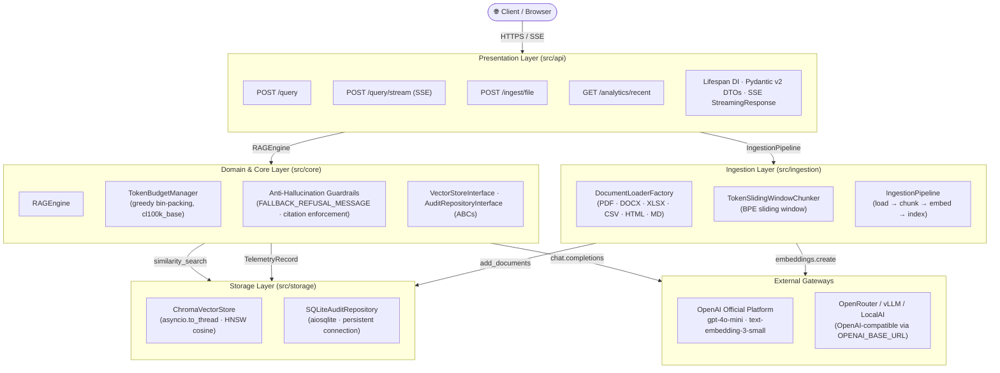

# DocuQuery RAG Agent


[](https://github.com/Yasinyan23/rag-agent/actions/workflows/ci.yml)


> **Enterprise-grade Retrieval-Augmented Generation microservice.** Strict grounding. Zero hallucinations. Full async. Production-ready from day one.

---

## The Problem With Naive RAG in Enterprise B2B

Standard off-the-shelf RAG pipelines fail in production for three predictable reasons:

| Failure Mode | Root Cause | Business Impact |
|---|---|---|
| **Hallucinated answers** | LLM generates facts not present in retrieved context | Legal liability, lost client trust, compliance failures |
| **Unbounded token costs** | No context window budgeting; full documents injected into every prompt | Unpredictable OpenAI API bills at scale |
| **Ungrounded responses** | No citation enforcement; impossible to audit where an answer came from | Cannot satisfy SOC 2, HIPAA, or internal governance requirements |

**DocuQuery solves all three problems by design, not by convention.**

---

## Architecture

DocuQuery is a Clean Architecture FastAPI microservice with five strictly bounded layers. Dependency arrows point strictly inward: the presentation layer (`api`) never touches the database; the storage layer never formats response payloads.



**Query flow (non-streaming):**

```
POST /api/v1/query/
        │
        ├─ 1. Embed query          → OpenAI text-embedding-3-small
        ├─ 2. Retrieve top-k       → ChromaDB HNSW cosine similarity
        ├─ 3. Score filter         → discard chunks below score_threshold
        ├─ 4. Fast-path refusal    → if no chunks pass → return FALLBACK_REFUSAL_MESSAGE
        ├─ 5. Token budgeting      → TokenBudgetManager (cl100k_base, greedy descending score)
        ├─ 6. Prompt assembly      → build_rag_prompt() with anti-hallucination system prompt
        ├─ 7. LLM completion       → OpenAI GPT-4o-mini, temperature=0.0
        ├─ 8. Citation extraction  → one Citation per budgeted chunk
        └─ 9. Telemetry logging    → TelemetryRecord → SQLite audit trail
```

---

## Production Features

### Anti-Hallucination Guardrails

Every LLM call is governed by a system prompt that **explicitly prohibits**:
- Using knowledge beyond the provided context chunks.
- Fabricating facts, inventing sources, or speculating.
- Returning anything other than `FALLBACK_REFUSAL_MESSAGE` when context is insufficient.

When no retrieved chunk meets the similarity score threshold, the LLM is **never called** — the deterministic refusal phrase is returned immediately with zero token cost.

### Mandatory Source Citations

Every factual statement in every LLM response must carry:

```
[Source: <filename>, Section: <markdown-heading>]
```

This citation format is enforced by prompt design. Every `Citation` object in the API response maps back to an exact `DocumentChunk` in the vector index, with full provenance (`source`, `section`, `chunk_id`).

### Token Budget Enforcement

`TokenBudgetManager` applies a greedy descending-score bin-packing algorithm before every LLM call. Chunks are selected in order of semantic relevance until the configured token ceiling is reached. No unbounded context is ever injected into a prompt.

### SSE Streaming

`POST /api/v1/query/stream` yields incremental token deltas via Server-Sent Events with proxy-buffering bypass headers (`X-Accel-Buffering: no`, `Cache-Control: no-cache`). The stream terminates with the explicit `[DONE]` sentinel, compatible with browser `EventSource` and all SSE-aware HTTP clients.

### Full Async I/O

Every network call, database operation, and filesystem interaction is `async`/`await`. The sole synchronous exception — ChromaDB's local driver — is explicitly offloaded via `asyncio.to_thread()`. The FastAPI event loop is never blocked.

### Clean Architecture with Dependency Inversion

All service instances (vector store, OpenAI client, audit repository, RAG engine) are constructed **once** at application startup and shared across requests via `app.state`. Routers depend on abstract interfaces, not on concrete adapters. Swapping ChromaDB for Weaviate requires changing one file.

### Universal Multi-Format Document Ingestion

DocuQuery utilizes an extensible **Strategy + Factory** pattern (`DocumentLoaderFactory`) offloaded to `asyncio.to_thread` for non-blocking I/O. Citations are strictly anchored to source-native sections and pages:

| Format | Extensions | Extraction Strategy & Provenance | Engine / Library |
|---|---|---|---|
| **Markdown & Text** | `.md`, `.txt` | Direct UTF-8 stream decode, ATX heading section tracking (`# Section`) | Built-in |
| **PDF Documents** | `.pdf` | Multi-page text extraction with page-level citations (`Section: Page {n}`) | `pypdf` |
| **Word Documents** | `.docx` | Paragraph & table body traversal with heading mapping (`#`..`######`) | `python-docx` |
| **Tabular Spreadsheets** | `.xlsx` | Multi-sheet parsing with sheet-anchored citations (`Section: Sheet: {name}`) | `openpyxl` |
| **Delimited Data** | `.csv` | Dialect/delimiter sniffing, multi-encoding fallback, table / key-value views | Built-in (`csv`) |
| **HTML / Web Pages** | `.html`, `.htm` | DOM cleanup (stripping `<script>`, `<style>`, `<nav>`, `<footer>`), `h1-h6` conversion | `beautifulsoup4` |

---

## Quickstart

### Option A: Docker Compose (Recommended for Production Preview)

```bash
# 1. Clone and configure
git clone https://github.com/Yasinyan23/rag-agent.git
cd rag-agent
cp .env.example .env
# Edit .env and set OPENAI_API_KEY=sk-...

# 2. Build and start
docker compose up --build

# 3. Verify health
curl http://localhost:8000/api/v1/health/
```

The `./data` directory on the host is bind-mounted into the container, so ChromaDB vector indices and SQLite telemetry persist across container restarts.

### Option B: Local Development

**Prerequisites:** Python 3.11+

```bash
# 1. Create a virtual environment
python -m venv .venv
source .venv/bin/activate        # Linux / macOS
.venv\Scripts\Activate.ps1       # Windows PowerShell

# 2. Install dependencies
pip install -e ".[dev]"

# 3. Configure environment
cp .env.example .env
# Edit .env and set OPENAI_API_KEY=sk-...

# 4. Start the server with hot-reload
uvicorn src.main:app --reload --port 8000

# 5. Open the interactive API docs
# Swagger UI  → http://localhost:8000/api/docs
# ReDoc       → http://localhost:8000/api/redoc
# Root path / → automatically redirects to /api/docs
```

---

## API Reference

All endpoints are served under `/api/v1`. Interactive documentation is available at `/api/docs` (Swagger UI) and `/api/redoc`.

### Liveness Probe

```bash
curl -s http://localhost:8000/api/v1/health/ | jq
```

```json
{
  "status": "ok",
  "app_name": "DocuQuery RAG Agent",
  "version": "0.1.0",
  "environment": "development"
}
```

---

### Ingest a Document

Upload a supported document. Accepted extensions: `.md`, `.txt`, `.pdf`, `.docx`, `.csv`, `.xlsx`, `.html`, `.htm`. The service loads via the format-specific loader, chunks, embeds, and indexes the content.

```bash
# Markdown
curl -s -X POST http://localhost:8000/api/v1/ingest/file \
  -F "file=@data/sample_docs/sla_policy.md" | jq

# PDF or Word (same endpoint; path is your local file)
curl -s -X POST http://localhost:8000/api/v1/ingest/file \
  -F "file=@./enterprise_policy.docx" | jq
```

```json
{
  "status": "success",
  "filename": "sla_policy.md",
  "chunks_ingested": 42
}
```

---

### Standard Query with Citations

```bash
curl -s -X POST http://localhost:8000/api/v1/query/ \
  -H "Content-Type: application/json" \
  -d '{
    "query": "What are the initial response times for a P0 outage under Tier 1 Enterprise Platinum?",
    "top_k": 5,
    "score_threshold": 0.3
  }' | jq
```

```json
{
  "query": "What are the initial response times for a P0 outage under Tier 1 Enterprise Platinum?",
  "answer": "Under the Tier 1 Enterprise Platinum SLA, a P0 (Service Outage) incident — defined as complete API unavailability or data loss — requires an initial response within 15 minutes. [Source: sla_policy, Section: 2.1 Tier 1 — Enterprise Platinum]",
  "citations": [
    {
      "source": "sla_policy",
      "section": "2.1 Tier 1 — Enterprise Platinum",
      "chunk_id": "sla_policy#c0003"
    }
  ],
  "latency_ms": 1842.7,
  "total_tokens": 312
}
```

---

### Streaming Query (Token-by-Token SSE)

```bash
curl -s -X POST http://localhost:8000/api/v1/query/stream \
  -H "Content-Type: application/json" \
  -d '{"query": "What encryption standards are used for data at rest?"}' \
  --no-buffer
```

```
data: {"token": "Data"}
data: {"token": " at"}
data: {"token": " rest"}
data: {"token": " is"}
data: {"token": " encrypted"}
data: {"token": " using"}
data: {"token": " AES"}
data: {"token": "-256"}
data: {"token": "-GCM"}
...
data: [DONE]
```

---

### Telemetry & Latency Audit

```bash
curl -s "http://localhost:8000/api/v1/analytics/recent?limit=5" | jq
```

```json
{
  "records": [
    {
      "request_id": "a3f8b21c-4d92-4e1a-b7f3-9c2d1e6a8b05",
      "query_text": "What are the P0 response times?",
      "response_text": "Under Tier 1 Enterprise Platinum...",
      "latency_ms": 1842.7,
      "prompt_tokens": 289,
      "completion_tokens": 23,
      "total_tokens": 312,
      "model_name": "gpt-4o-mini",
      "created_at": "2026-09-19T10:42:31Z"
    }
  ],
  "total_count": 1
}
```

---

### Out-of-Scope Query (Anti-Hallucination Verification)

Queries with no grounding evidence in the indexed corpus return the deterministic refusal phrase — never a hallucinated answer.

```bash
curl -s -X POST http://localhost:8000/api/v1/query/ \
  -H "Content-Type: application/json" \
  -d '{"query": "What is the meaning of life according to the documentation?"}' | jq '.answer'
```

```
"I am sorry, but the provided documentation does not contain sufficient information to answer your question."
```

---

## Multi-Gateway Support

DocuQuery targets **any OpenAI-compatible inference gateway** with zero codebase changes. The `OPENAI_BASE_URL` setting is the single control point:

| Gateway | `OPENAI_BASE_URL` | `OPENAI_API_KEY` |
|---|---|---|
| OpenAI (default) | *(unset)* | `sk-...` |
| [OpenRouter](https://openrouter.ai) | `https://openrouter.ai/api/v1` | OpenRouter key |
| vLLM (self-hosted) | `http://localhost:8001/v1` | `EMPTY` |
| LocalAI | `http://localhost:8080/v1` | `sk-unused` |
| Azure OpenAI | `https://<resource>.openai.azure.com/openai` | Azure key |

Both LLM completions (`chat.completions`) and embedding calls (`embeddings.create`) are routed through the same base URL. No adapter swap, no code change — only environment variables.

---

## Verified Live Evaluation

The following results are captured against the indexed document **"THE SCIENTIFIC METHOD IN IT AND COMPUTER SCIENCE"** ingested into a live development instance.

### Grounded Query — Structured JSON Response

```bash
curl -s -X POST http://localhost:8000/api/v1/query/ \
  -H "Content-Type: application/json" \
  -d '{
    "query": "On what three principles does the scientific method in computer science rest?",
    "top_k": 5,
    "score_threshold": 0.3
  }' | jq
```

```json
{
  "query": "On what three principles does the scientific method in computer science rest?",
  "answer": "The scientific method in computer science rests on three core principles: (1) empirical observation — conclusions must be grounded in measurable, reproducible evidence; (2) falsifiability — a hypothesis must be formulated in a way that allows it to be disproven; and (3) systematic experimentation — claims must be validated through controlled, repeatable procedures. [Source: the_scientific_method_in_it_and_computer_science, Section: 2. Core Principles of the Scientific Method]",
  "citations": [
    {
      "source": "the_scientific_method_in_it_and_computer_science",
      "section": "2. Core Principles of the Scientific Method",
      "chunk_id": "the_scientific_method_in_it_and_computer_science#c0002"
    },
    {
      "source": "the_scientific_method_in_it_and_computer_science",
      "section": "2. Core Principles of the Scientific Method",
      "chunk_id": "the_scientific_method_in_it_and_computer_science#c0003"
    }
  ],
  "latency_ms": 1673.4,
  "total_tokens": 387
}
```

### Refusal Guardrail — Out-of-Scope Concepts

Queries about topics absent from the indexed corpus (such as ML data drift and overfitting) trigger the deterministic `FALLBACK_REFUSAL_MESSAGE`, returning an empty citations array (`citations: []`) and preventing hallucinated output.

```bash
curl -s -X POST http://localhost:8000/api/v1/query/ \
  -H "Content-Type: application/json" \
  -d '{
    "query": "How does ML data drift and model overfitting affect production inference pipelines?",
    "top_k": 5,
    "score_threshold": 0.3
  }' | jq
```

```json
{
  "query": "How does ML data drift and model overfitting affect production inference pipelines?",
  "answer": "I am sorry, but the provided documentation does not contain sufficient information to answer your question.",
  "citations": [],
  "latency_ms": 3144.8,
  "total_tokens": 723
}
```

> **Observation:** The retrieval stage identified relevant background chunks for the general IT query, but because specific mechanisms for ML data drift and overfitting were absent from the source document, the LLM guardrail strictly returned `FALLBACK_REFUSAL_MESSAGE` and suppressed citations (`citations: []`), eliminating the risk of external fabrication.

---

## Quality Assurance

### Running the Test Suite

```bash
# Run full automated test suite (160 tests)
pytest -v

# Run only unit tests
pytest tests/unit/

# Run only integration tests
pytest tests/integration/

# Run offline multi-format loader smoke verification
python scripts/verify_all_loaders.py
```

All tests are fully isolated: no live OpenAI credentials, no running ChromaDB server, and no network access are required. Mocks cover all external boundaries.

### Linting and Formatting

```bash
# Check for lint violations
ruff check src/ tests/

# Auto-fix lint issues
ruff check --fix src/ tests/

# Format code
ruff format src/ tests/

# Check formatting without modifying files
ruff format --check src/ tests/
```

### End-to-End Smoke Test

After starting the server, run the automated smoke test to verify the full pipeline end-to-end:

```bash
# Against the local dev server
python scripts/smoke_test.py

# Against a custom URL (e.g. Docker Compose)
python scripts/smoke_test.py --base-url http://localhost:8000
```

The smoke test probes all six critical paths: health, document ingestion, grounded query with citations, out-of-scope refusal, SSE streaming, and analytics telemetry.

---

## Configuration

All configuration is read from environment variables (or `.env` file) via Pydantic Settings. See `.env.example` for the full reference.

| Variable | Default | Description |
|---|---|---|
| `OPENAI_API_KEY` | *(required)* | OpenAI API key (or your gateway's key) |
| `OPENAI_MODEL` | `gpt-4o-mini` | LLM model for completions |
| `EMBEDDING_MODEL` | `text-embedding-3-small` | OpenAI embedding model |
| `OPENAI_BASE_URL` | *(unset — uses OpenAI platform)* | Custom OpenAI-compatible gateway URL |
| `APP_ENV` | `development` | Runtime environment (`development`, `staging`, `production`) |
| `APP_PORT` | `8000` | Server port |
| `LOG_LEVEL` | `INFO` | Root log level |
| `CHROMA_PERSIST_DIRECTORY` | `./data/chroma_db` | ChromaDB persistence path |
| `SQLITE_DATABASE_PATH` | `./data/telemetry.db` | SQLite audit database path |

> **OpenRouter & Custom Gateways:** Set `OPENAI_BASE_URL=https://openrouter.ai/api/v1` and `OPENAI_API_KEY=<your-openrouter-key>` to route all LLM and embedding calls through OpenRouter or any other OpenAI-compatible provider (vLLM, LocalAI, Azure OpenAI). When unset, the service targets the official OpenAI platform. No code changes required.

---

## Project Structure

```
rag-agent/
├── src/
│   ├── config/          # Pydantic Settings — typed environment configuration
│   ├── core/
│   │   ├── models.py    # Domain models: DocumentChunk, RetrievalResult, Citation, RAGResult
│   │   ├── interfaces.py# ABCs: VectorStoreInterface, AuditRepositoryInterface
│   │   ├── exceptions.py# AppException hierarchy (ConfigurationError, StorageError, …)
│   │   └── rag/
│   │       ├── engine.py       # RAGEngine — full query and streaming pipeline
│   │       ├── token_counter.py# TokenBudgetManager — greedy bin-packing
│   │       └── prompts.py      # Anti-hallucination system prompt + citation format
│   ├── ingestion/
│   │   ├── loaders/     # BaseDocumentLoader, Factory, PDF, DOCX, CSV, Excel, HTML, Text
│   │   ├── chunker.py   # TokenSlidingWindowChunker — cl100k_base BPE sliding window
│   │   └── pipeline.py  # IngestionPipeline — load → chunk → embed → index
│   ├── storage/
│   │   ├── vector_store.py# ChromaVectorStore — asyncio.to_thread HNSW adapter
│   │   └── audit_db.py  # SQLiteAuditRepository — aiosqlite persistent connection
│   ├── api/
│   │   ├── routes/      # health · query · ingestion · analytics routers
│   │   ├── schemas/     # QueryRequest · QueryResponse · IngestResponse · AnalyticsResponse
│   │   └── dependencies.py# Depends factories resolving services from app.state
│   └── main.py          # FastAPI app · lifespan DI graph · exception handlers
├── tests/
│   ├── unit/            # Unit tests (loaders, chunker, RAG, settings — zero live APIs)
│   └── integration/     # Integration tests (mocked engine/pipeline/repo)
├── data/
│   └── sample_docs/     # Enterprise sample documents for testing and demos
├── scripts/
│   ├── smoke_test.py           # Async E2E smoke test script (httpx)
│   └── verify_all_loaders.py   # Offline loader verification suite
├── docs/
│   └── internal/
│       ├── architecture.md  # Authoritative architecture reference + ADR log
│       └── state.md         # Living implementation state + test inventory
├── Dockerfile           # Multi-stage production image (non-root, slim)
├── docker-compose.yml   # Local development compose with bind-mounted data volume
├── pyproject.toml       # Project metadata, dependencies, Ruff, and Pytest config
└── .env.example         # Environment variable reference template
```

---

## Architectural Decision Records

The full ADR log is maintained in [`docs/internal/architecture.md`](docs/internal/architecture.md). Key decisions:

| ADR | Decision |
|---|---|
| ADR-01 | ChromaDB blocking calls dispatched via `asyncio.to_thread()` |
| ADR-02 | Single persistent `aiosqlite` connection shared across lifespan |
| ADR-03 | Embedding vectors passed as a separate parameter, not embedded in `DocumentChunk` |
| ADR-04 | Heading-inclusive scan for Markdown section attribution |
| ADR-05 | SSE streaming with `X-Accel-Buffering: no` proxy-bypass headers |
| ADR-06 | Single-instance lifespan DI graph shared between ingestion and query engines |

---

## License

MIT © 2026 DocuQuery Contributors
